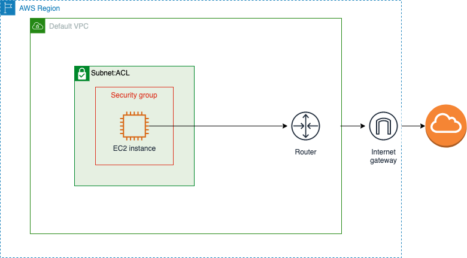

# Building a secure network in AWS (PART 1)

Assume you've been asked to create a VM on AWS to run some critical operations for your business; it needs to access the internet, but only can be accessed by the maintainers (e.g. people/services who would want to install/upgrade the software). How would you do it?

This is a series of 2 posts. In the first post, we will go over what happens when you create an EC2 instance (VM) in AWS; it would be an introductory post for another article about architecting a secure solution in a secure network in the cloud.

_Why is that important?_

When building solutions in the cloud, it is critical to keep security in mind. In fact, it's critical to keep it as a high priority, if not the highest.

Also, I would like to highlight the importance of keeping resources within private subnets in AWS (or in any other cloud), as that's something I used to ignore as I implemented solutions progressively in the past. However, as the system scales it would be much more difficult to adjust and change these configurations.

As mentioned earlier, in this example, we would want to build a server that has outbound access to the internet but denies inbound traffic except for maintainers through SSH.

## Create an EC2 instance

We can simply create a new EC2 instance using CloudFormation. The template would look like this:

```
AWSTemplateFormatVersion: "2010-09-09"
Description: Secure EC2 instance that can access the internet

Resources:
  AwesomeEC2Instance:
    Type: "AWS::EC2::Instance"
    Properties:
      ImageId: "ami-0947d2ba12ee1ff75"
      InstanceType: "t2.micro"
      Tags:
        - Key: "Name"
          Value: "AwesomeEC2Instance"
        - Key: "Owner"
          Value: "Ali"
```

Now let's create this stack in CloudFormation. I will use the command line to do that, but feel free to do this manually from the AWS Console.

```
aws cloudformation create-stack --stack-name private-network --template-body file://infra/template.yml
```

Open the AWS console, and navigate to CloudFormation. Check the events: 

Below is a set of operations executed behind the scenes when we create an EC2 instance this way (After this list we will each component explaining its functionality, which would give more familiarity with the user terms):

- Obviously, the VM itself got created. Navigate to EC2 and note the creation of the EC2 instance.
- Select the instance and navigate to the "Networking" tab. Note how the instance got created in a VPC and a subnet, without us explicitly specifying it.
- Navigate to the Security tab. Note that the default security group is attached to the created instance.
  - This security group has outbound rules showing `0.0.0.0/0` as destination --> this means traffic from this instance can go to the public internet.
  - This security group has inbound rules showing all from src equal to the same security --> this means this security group is only accessible from other resources within the same security group.
    

## SSH to the instance

Before getting into the explanation of these components, let us try to connect to the instance to get an understanding of the current access level.

- Right-click the instance and click "Connect". In the "EC2 Instance Connect" tab click the "Connect" button
  - This allows a simple and secure way to connect to the created EC2 instance using Secure Shell (SSH), without needing to share keys
  - The newly opened tab shows the following error: 
    This is because the inbound access is only allowed from resources within the same security group. To overcome that, we can edit the inbound rule on the security group to allow ssh access from your own IP address only: 
  - Try to connect again. A shell opens now in the new tab with a successful ssh connection to the instance. Type `ping 1.1.1.1` and you should get a result.

This shows us that we are able to connect to the internet from within the instance, and we can securely SSH to the instance. This was all handled on the security level group, which should be the last level of defense ideally. How to do this in a better manner? This will be the topic of the following blog post - but would love to get your thoughts until then.

## What are all of these components that got attached/utilised?

In this section we will set out in details these components that got attached when we created our EC2 instance.

First, it is worth mentioning that the EC2 service in AWS is a private service. This means it is not connected to the internet by default (this has nothing to do with the ability to access it or not, but purely related to its network setup); As you've seen in the previous section, we got some other configuration in place to get a proper connection to our EC2 instance.

In summary, The full set of used components would look something similar to the following diagram: .

Below are some additional details.

### VPC - We got a VPC (Virtual private network) attached to our instance

A VPC is an AWS service where you create a private isolated network. In this network, you can define network addresses for your infrastructure among other details.

- That's the default VPC that gets created automatically when you create an AWS account.
- The VPC is a regional service, so you would find a different default VPC in every region. The VPC attached to the EC2 instance is the one that got created in the same region having that instance.

### Subnet

The subnet is simply a subnetwork of a VPC within a single avaialability zone.

The default VPC has multiple subnets (one subnet in each Availability Zone of the region where the VPC is created). The EC2 instance gets created in a single zone as well, so we have the subnet of that zone associated to it.

### Route Table

Every VPC has a router that is used to route the traffic between subnets and controlled by a route table. When traffic leaves the subnet, the VPC router checks the destination field of the route and determines where to send to traffic using the target field.

The following table shows that all traffic with destination IPs in the `172.31.0.0/16` network will target local, that's the VPC network. Traffic with destination `0.0.0.0/0` will target the internet gateway: 

### Internet Gateway

It's a gateway that allows communication between the VPC and the internet.

### NACL

That's the network access control list, which provides a layer of security or filtering of traffic around the subnet. By default, it allows all inbound and outbound traffic. Each subnet in the VPC is associated with this NACL. It is possible to explicitly configure it to allow or deny certain traffic.

### Security Group

A security group also filters the traffic but handles security differently from NACLs. By default, the Security Group has an implicit deny rule for all incoming traffic and allows all outbound traffic. It is not possible to explicitly deny traffic in a security group such as stopping traffic coming from a certain IP (that's when we use NACL).

I hope this was helpful. How would you suggest configuring the network the next time you are asked to create an EC2 instance?

Watch this space for the second part.
