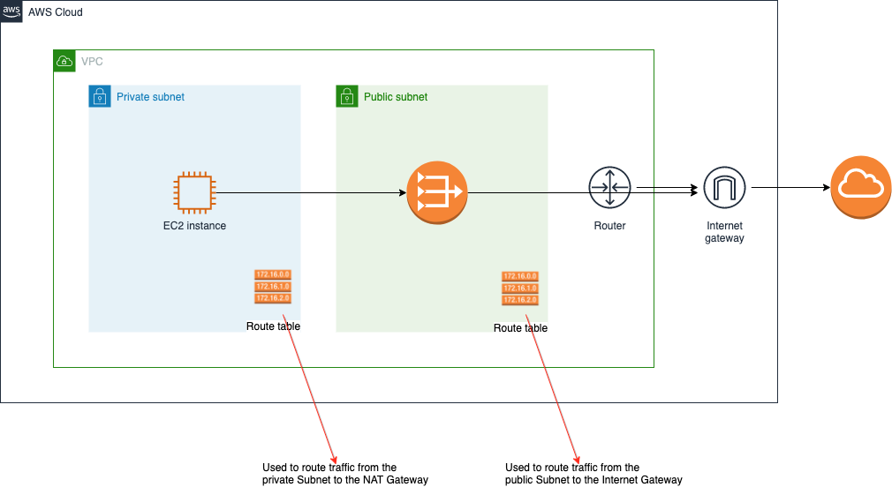
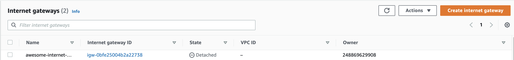
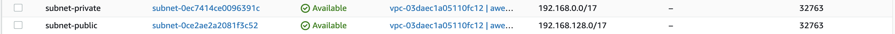
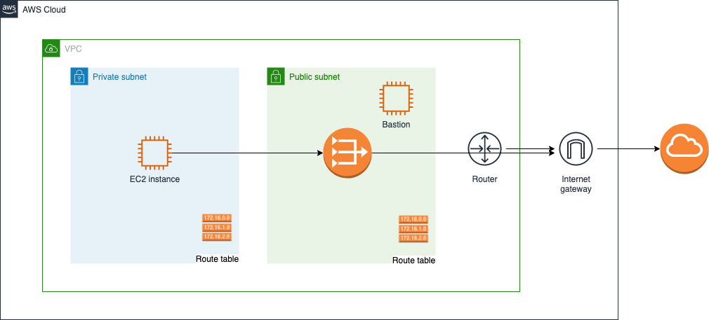

# Building a secure network in AWS (PART 2)

Assume you've been asked to create a VM on AWS to run some critical operations for your business; it needs to access the internet, but only can be accessed by the maintainers (e.g. people/services who would want to install/upgrade the software). How would you do it?

This is a series of 2 posts. In the first post, we went over what happens when we create an EC2 instance (VM) in AWS, where we explained how the instance gets attached to the default VPC and the traffic gets routed.

In this second post, we will go over creating a fully secure network where the newly created VM will operate.

_Why can't we just use the default vpc?_

The default VPC is available to get users started quickly without thinking about the underlying network. So it works great if you are doing some simple deployments, or If you are testing or experimenting in AWS.

The default VPC has multiple components associated with it, such as subnets, NACLs, Security Group, and Route table. Some of these components are open publicly, which does not form the most solid security practice.

Moreover, using the default VPC will limit the user to using the `172.31.0.0/116` range. By having a custom VPC the customer will be able to tailor the network as they want and avoid overlapping IP addresses, including on-premise networks

It is recommended to configure a custom VPC, where the user has full control over the network model and its components. This makes it easier to scale the application and architecture within private subnets.

## Custom VPC with outbound access

The architecture would look like the following diagram, where we only allow outbound access from our VPC to the internet ( we will cover how to enable inbound access for the VM maintainers in the following sections and update the diagram accordingly). 

In the following sub-sections, we will create the necessary resources progressively using cloud formation. At every step of this section, I suggest you upload the template to CloudFromation and have a look at the resources that get created with the stack. Use the following command at your convenience (or upload the template manually from the console):

To create the stack - `aws cloudformation create-stack --stack-name private-network --template-body file://infra/template-custom-vpc.yml`

To update the stack - `aws cloudformation update-stack --stack-name private-network --template-body file://infra/template-custom-vpc.yml`

### VPC

Use the following template to create the custom VPC:

```
Resources:
  VPC:
    Type: AWS::EC2::VPC
    Properties:
      CidrBlock: 192.168.0.0/16
      EnableDnsSupport: true
      EnableDnsHostnames: true
      Tags:
        - Key: Name
          Value: awesome-vpc
```

In this previous snippet, we have given a name for the VPC, a CidrBlock that defines the range of IPS that could be utilised (in this case from 192.168.0.0 to 192.168.255.255). When setting the EnableDnsSupport and EnableDnsHostnames flags to true, the instances with a public IP address get corresponding public DNS hostnames, and the Amazon Route 53 Resolver server can resolve Amazon-provided private DNS hostname. If you're curious to know more check the detailed AWS documentation: https://docs.aws.amazon.com/vpc/latest/userguide/vpc-dns.html.

### Internet Gateway

In the template file, under "Resources", add the following:

```
  InternetGateway:
    Type: 'AWS::EC2::InternetGateway'
    Properties:
      Tags:
      - Key: Name
        Value: awesome-internet-gateway
```

This would create the internet gateway, but it won't be attached to a VPC: 

Add the following resource to your template to attach the internet gateway to the created VPC:

```
  VpcInternetGatewayAttachment:
    Type: 'AWS::EC2::VPCGatewayAttachment'
    Properties:
      VpcId: !Ref VPC
      InternetGatewayId: !Ref InternetGateway
```

### Subnets

Afterward, we will create 2 subnets, one private and one public - the private one will contain our EC2 instance and the other can connect to the internet through the internet gateway.

```
  SubnetPrivate:
    Type: AWS::EC2::Subnet
    Properties:
      VpcId: !Ref VPC
      AvailabilityZone: !Select [ 0, !GetAZs '' ]
      CidrBlock: 192.168.0.0/17
      Tags:
        - Key: Name
          Value: subnet-private
  SubnetPublic:
    Type: AWS::EC2::Subnet
    Properties:
      VpcId: !Ref VPC
      AvailabilityZone: !Select [ 0, !GetAZs '' ]
      CidrBlock: 192.168.128.0/17
      MapPublicIpOnLaunch: true
      Tags:
        - Key: Name
          Value: subnet-public
```

When creating a subnet we do not decide whether it's private or public through a configuration on creation, so for this step, these are the subnets that are intended to be private and public; we will configure them for that in future steps: 

Notice how we split the CIDR blocks of the VPC into 2 CIDR blocks (one for each subnet). The Availability zone property uses 2 CloudFormation intrinsic functions:

- GetAZs, which returns a list of all of the Availability zones for a specific region; specifying an empty string is equivalent to specifying the region in which the CloudFormation stack is created
- Select, which returns a single object from a list of objects by index

In this case, we are getting the first availability zone in the us-east-1 region, in which we're creating the stack.

The MapPublicIpOnLaunch property in the public subnet indicates whether instances launched in this subnet receive a public IPv4 address. This might be confusing as we discussed creating the EC2 instance in the private network, so why are we adding this configuration? Briefly, we will create another EC2 instance in the public subnet, which would be a utility to SSH into the private subnet instance later on. We will get back to more details about this instance in the coming steps.

### Route table - public subnet

We will now create a route table and associate it with the public subnet, in addition to a default route

```
  RouteTablePublic:
    Type: AWS::EC2::RouteTable
    Properties:
      VpcId: !Ref VPC
      Tags:
      - Key: Name
        Value: route-table-public
  RouteTableAssociationSubnetPublic:
    Type: AWS::EC2::SubnetRouteTableAssociation
    Properties:
      SubnetId: !Ref SubnetPublic
      RouteTableId: !Ref RouteTablePublic
  RouteTableDefaultPublic:
    Type: AWS::EC2::Route
    DependsOn: VpcInternetGatewayAttachment
    Properties:
      RouteTableId: !Ref RouteTablePublic
      DestinationCidrBlock: '0.0.0.0/0'
      GatewayId: !Ref InternetGateway
```

Looking at the created route table, we will see it associated with the public subnet, and has the following routes - the record with 0.0.0.0/0 as a destination will target the internet gateway created: 

### NAT Gateway

The NAT(Network Address Translation) is the method of giving a private resource access to the internet. It always uses Elastic IPs (Static public IPs).

```
  NatGatewayEIP:
    Type: AWS::EC2::EIP
    DependsOn: VpcInternetGatewayAttachment
    Properties:
      Domain: vpc
  NatGateway:
    Type: AWS::EC2::NatGateway
    Properties:
      AllocationId: !GetAtt NatGatewayEIP.AllocationId
      SubnetId: !Ref SubnetPublic
```

The NAT gateway we created is associated with the public subnet.

### Route table - private subnet

As we have created the NAT gateway, we will now create the route table associated with the private network, with a route targeting the NAT gateway. This should look like this:

```
  RouteTablePrivate:
    Type: AWS::EC2::RouteTable
    Properties:
      VpcId: !Ref VPC
      Tags:
      - Key: Name
        Value: route-table-private
  RouteTableAssociationSubnetPrivate:
    Type: AWS::EC2::SubnetRouteTableAssociation
    Properties:
      SubnetId: !Ref SubnetPrivate
      RouteTableId: !Ref RouteTablePrivate
  RouteTableDefaultPrivate:
    Type: AWS::EC2::Route
    Properties:
      RouteTableId: !Ref RouteTablePrivate
      DestinationCidrBlock: '0.0.0.0/0'
      NatGatewayId: !Ref NatGateway
```

## Private VM Creation

In the previous section, we have set up the VPC and necessary components that would allow the interaction of our private VM with the internet. Let us create the private EC2 instance and its associated security group, then try to connect to it using SSH:

```
  AwesomeEC2Instance:
    Type: AWS::EC2::Instance
    Properties:
      InstanceType: t2.micro
      ImageId: ami-0947d2ba12ee1ff75
      Tags:
        - Key: Name
          Value: Private Instance
      KeyName: !Ref KeyName
      NetworkInterfaces:
        - AssociatePublicIpAddress: true
          DeviceIndex: 0
          GroupSet:
            - !Ref AwesomeSecurityGroup
          SubnetId:
            !Ref SubnetPrivate
  AwesomeSecurityGroup:
    Type: AWS::EC2::SecurityGroup
    Properties:
      VpcId: !Ref SubnetPrivate
      GroupDescription: Enable SSH access via port 22
      SecurityGroupIngress:
        - IpProtocol: tcp
          FromPort: 22
          ToPort: 22
          CidrIp: 0.0.0.0/0
```

This stack would fail because of the KeyName property, which was not passed anywhere. Follow the following steps to fix this:

- Create a key pair to be used to ssh to the EC2 instance: https://docs.aws.amazon.com/AWSEC2/latest/UserGuide/ec2-key-pairs.html#prepare-key-pair
- Add the following before the "Resources" section of your cloud formation template
  ```
  Parameters:
    KeyName:
      Description: EC2 KeyPair
      Type: AWS::EC2::KeyPair::KeyName
  ```
- When creating the CloudFormation stack pass the key - you can use the following in the command line: `aws cloudformation create-stack --stack-name private-network --template-body file://infra/template-custom-vpc.yml --parameters ParameterKey=KeyName,ParameterValue=<Name of the key you created in the first step>`. Alternatively, you can manually pass that param if you're using the console to upload the template and create the stack.

Perfect, by now you should have an EC2 instance running in the private subnet. Right-click it in the console and click "Connect". In the "EC2 Instance Connect" tab, click the "connect" button --> Notice you got an error, even though that EC2 instance has a security group attached that allows SSH connections. But as it is in a private network, we wouldn't be able to SSH to it from the internet.

## Allow inbound access

In this section, we will build the component(s) needed to allow the maintainers to SSH into the private EC2 instance, which we will create in the last section.

### Bastion host

In the subnets section, we mentioned the creation of an EC2 instance in the public subnet. That would be the bastion host. It is a server whose purpose is to provide access to a private network from an external network (e.g. the internet).

That's the only addition to our architectural diagram to allow ssh traffic from maintainers: 

```
  BastionHostEC2Instance:
    Type: AWS::EC2::Instance
    Properties:
      InstanceType: t2.micro
      ImageId: ami-0947d2ba12ee1ff75
      Tags:
        - Key: Name
          Value: Bastion Host
      KeyName: !Ref KeyName
      NetworkInterfaces:
        - AssociatePublicIpAddress: true
          DeviceIndex: 0
          GroupSet:
            - !Ref AwesomeSecurityGroup
          SubnetId:
            !Ref SubnetPublic
```

So to connect to the internal (private) instance, the user (maintainer) would want to ssh to the bastion host, and from it ssh to the private instance. Have a look at the following article for more details about SSH Agent Forwarding: https://aws.amazon.com/blogs/security/securely-connect-to-linux-instances-running-in-a-private-amazon-vpc/. If you like the quick version here's a summary below:

- Verify the SSH agent is running on your OS: `eval ssh-agent` (on MacOS) - If you got Agent pid with a process number, it means it's running
- Add the private part of the key to the agent: assuming my key is called ec2-instance.pem, the command on MacOS would be: `ssh-add -K ./ec2-instance.pem`. You should get an output saying Identity added.
- Go to the AWS console, right-click the newly created instance (Bastion host), and click "Connect"
- In the "SSH client" tab, follow the instructions to ssh from your terminal
- In the last command, we would need to update it to configure SSH forwarding. So instead `ssh -i "ec2-instance.pem" ec2-user@ec2-.....compute-1.amazonaws.com`, run the following command: `ssh -i -A "ec2-instance.pem" ec2-user@ec2-.....compute-1.amazonaws.com`
- If no errors appeared, we will now be connected to the Bastion host instance
- Now let's try to connect from the Bastion host through to the EC2 instance in the private network (Get the connection information the same as we did for the Bastion host) - In the last command in the SSH Client tab, delete the "-i" and the name of the key. So the command would look like this `ssh ec2-user@ec2-.....compute-1.amazonaws.com`
- Now you can see we are now on the private instance. Try running `ping 1.1.1.1` and notice how the instance has access to the internet.

That's it for the day. I hope this was helpful and would love to hear any feedback, comments, or questions.
